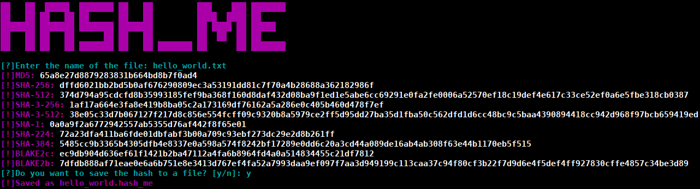

# hash_me
## Usage
 We can use the following command to hash a checksum of a file:
```shell
$ python hash_me.py <file>
```
The program first ask for the file name, and then proceeds to print, in different algorithms, the checksum of the file. Then, it asks if you want to save the checksums in a file. If you do, it will ask save it in a file with the same name as the file, but with the extension .hash_me. If you do not want to save the checksums, the program will exit.


## License
 🄯 copyleft all wrongs reserved